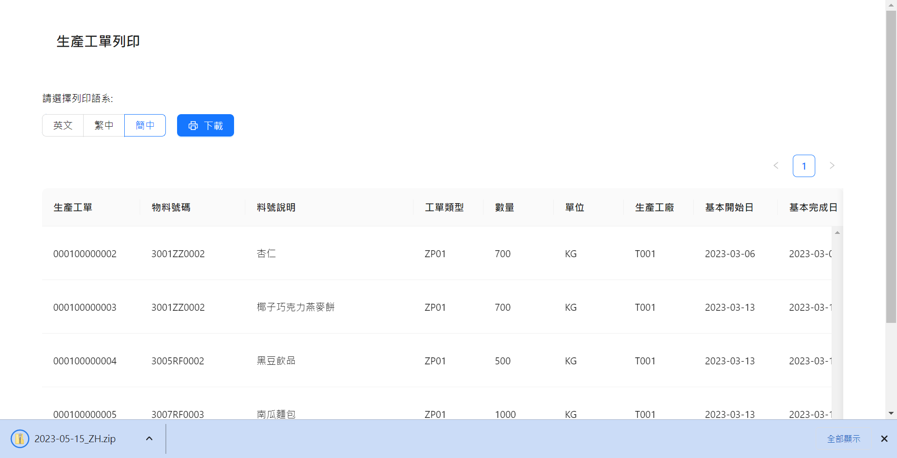
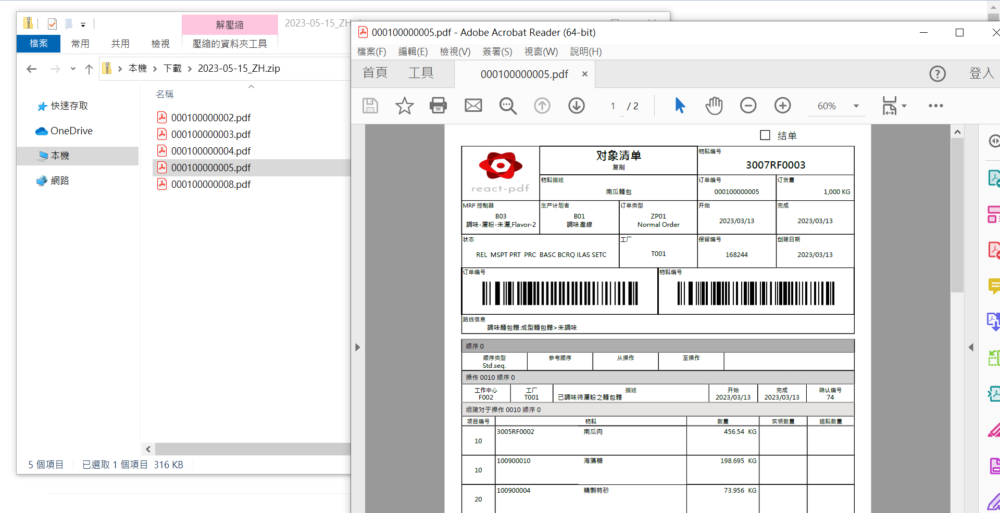

# react-pdf-custom-report

使用 react-pdf 繪製客製化報表並實現 zip 打包列印

## 使用動機

由客戶端接收到以下需求:

1. 需要實現一次下載多張工單
2. 客製化表格樣式、頁首頁尾樣式
3. 第二頁不顯示條碼區域
4. 部分表格不能分頁(如空間不夠即自動跳頁顯示)

使用原生 table 遇到需求需要取得頁碼判斷上的問題，由於現行 html 使用 @page 規則只能作用於根元素，React 在渲染時會自動在根元素外包裹一層 div，導致 @page 規則無法生效，於是使用 react-pdf 實現此需求。

## Demo





## 技術與工具

- react v18
- react-redux
  - redux-toolkit
- redux-saga
- styled-components
- @react-pdf/renderer
- jsbarcode
- file-saver
- jszip
  
## 執行

```cmd
npm i && npm run start
```
